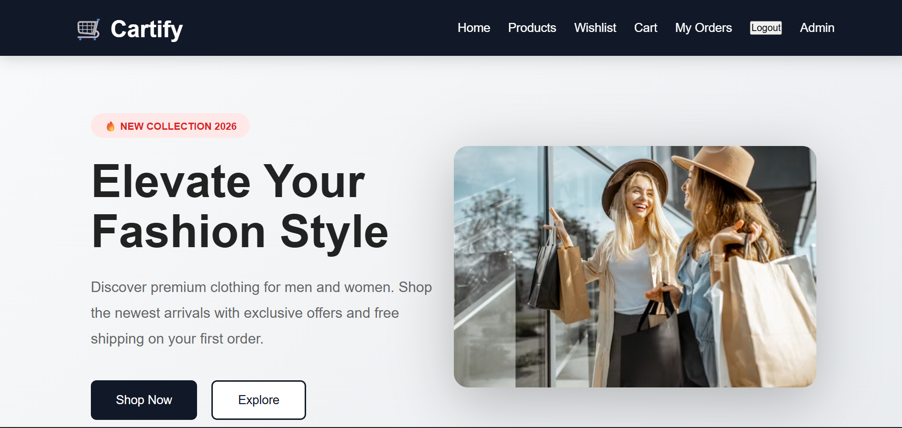
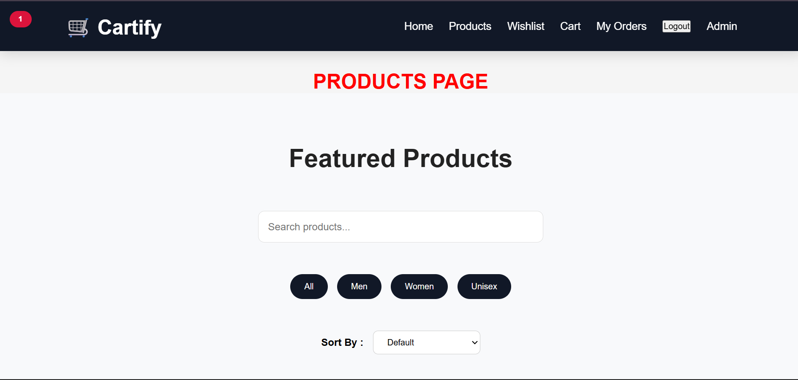
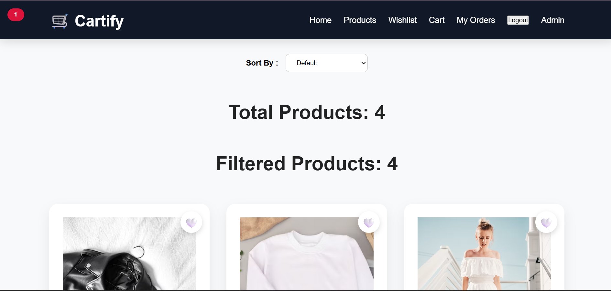
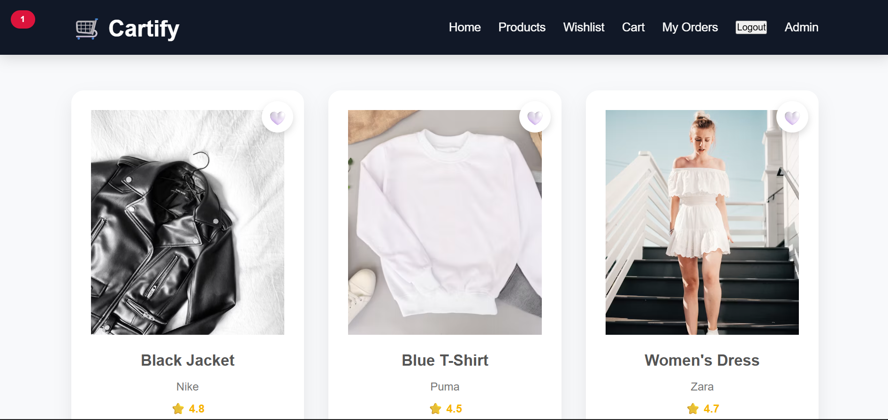
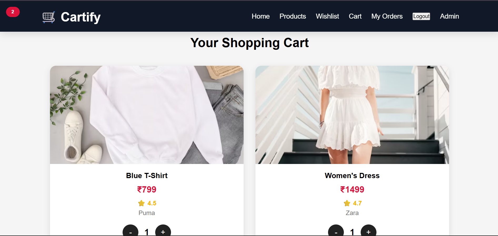
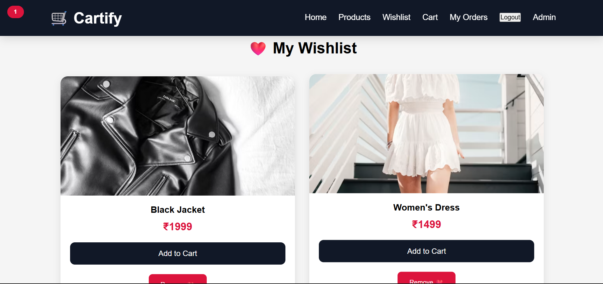
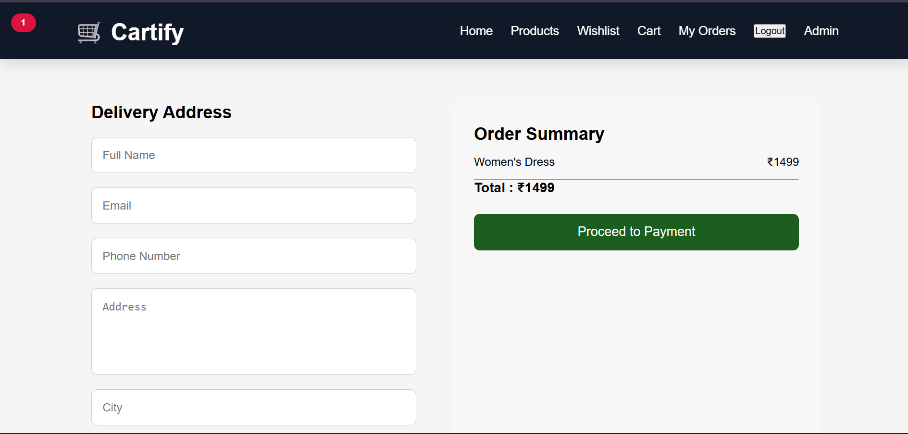
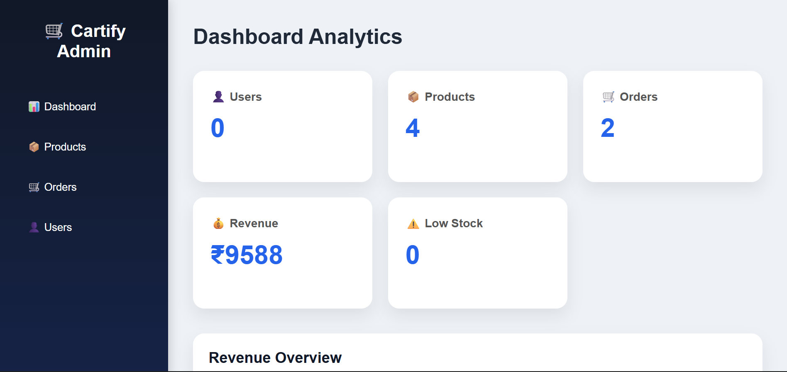

# 🛒 Cartify

> **Latest Release:** v1.1

<p align="center">
  <b>A Full-Stack E-Commerce Platform built using React, Flask, SQLite, GitHub Actions, Netlify and Render.</b>
</p>

<p align="center">
  
  
  
  
  
  
</p>

<p align="center">
  
</p>

---

# 📖 About

Cartify is a modern Full-Stack E-Commerce web application developed to understand how real-world online shopping platforms work from frontend to backend.

The application allows users to browse products, manage shopping carts and wishlists, place orders, write reviews, and interact with a complete admin dashboard for managing products, users, and orders.

The project follows REST API architecture and is deployed using Netlify (Frontend) and Render (Backend) with automated GitHub Actions workflows.

---

> **Note:** This project was built as a portfolio application to demonstrate full-stack development skills using React, Flask, SQLite, REST APIs, GitHub Actions, and modern deployment practices.

---

### 🌐 Live Application

- **Frontend:** https://incandescent-trifle-d64fa3.netlify.app
- **Backend API:** https://cartify-backend-en6t.onrender.com

---

## ⭐ Project Highlights

- Full-Stack E-Commerce Platform
- RESTful API Architecture
- Responsive React Frontend
- Flask Backend with SQLite
- Admin Dashboard
- GitHub Actions CI/CD
- Deployed on Netlify & Render

---

# ✨ Features

## 👤 User Module

- User Registration
- User Login
- Password Encryption using Bcrypt
- Product Browsing
- Search Products
- Filter Products
- Sort Products
- Wishlist Management
- Shopping Cart
- Quantity Management
- Order Placement
- Payment Simulation
- Order History
- Product Reviews

---

## 🛍 Product Module

- View Products
- Product Categories
- Stock Availability
- Product Ratings
- Brand Information

---

## 👨‍💼 Admin Module

- Admin Login
- Dashboard
- Manage Products
- Manage Users
- View Orders
- Update Order Status
- Delete Users
- Sales Overview

---

## ⚙ Deployment

- Frontend deployed using Netlify
- Backend deployed using Render
- Automatic deployment using GitHub Actions

---

# 🛠 Tech Stack

| Category | Technologies |
|----------|--------------|
| Frontend | React, Vite, JavaScript, CSS, Axios, React Router |
| Backend | Flask, Python, REST APIs, Flask Blueprints |
| Database | SQLite |
| Authentication | Bcrypt |
| Deployment | Netlify, Render |
| CI/CD | GitHub Actions |

---

# 🏗 System Architecture

```
                User
                  │
                  ▼
        React + Vite Frontend
                  │
          Axios HTTP Requests
                  │
                  ▼
        Flask REST API Backend
                  │
      ┌───────────┼────────────┐
      │           │            │
      ▼           ▼            ▼
   Products     Orders      Authentication
      │           │            │
      └───────────┼────────────┘
                  │
                  ▼
            SQLite Database
```

### Deployment

- **Frontend:** Netlify
- **Backend:** Render
- **CI/CD:** GitHub Actions

---

# 📂 Project Structure

```
Cartify
│
├── .github/
│   └── workflows/
│       ├── backend.yml
│       └── frontend.yml
│
├── backend/
│   ├── routes/
│   ├── images/
│   ├── app.py
│   ├── auth.py
│   ├── database.db
│   ├── database.py
│   ├── init_db.py
│   ├── jwt_utils.py
│   ├── Procfile
│   └── requirements.txt
│
├── images/
│   ├── home.png
│   ├── productpage01.png
│   ├── productpage02.png
│   ├── productpage03.png
│   ├── cart.png
│   ├── wishlist.png
│   ├── paymentpage.png
│   └── admin.png
│
├── public/
├── src/
│   ├── assets/
│   ├── charts/
│   ├── components/
│   ├── context/
│   ├── pages/
│   └── App.jsx
│
├── .env
├── .gitignore
├── eslint.config.js
├── index.html
├── package-lock.json
├── package.json
├── README.md
└── vite.config.js
```

---

# 🔄 REST APIs

| Module | APIs |
|---------|------|
| Authentication | Register, Login |
| Products | CRUD Products |
| Cart | Add, Update, Remove, View |
| Wishlist | Add, Remove, View |
| Orders | Place Order, View Orders, Update Status |
| Reviews | Add Review, View Reviews |

---

# 🚀 Installation

## 1️⃣ Clone the Repository

```bash
git clone https://github.com/codeWithKiru/Cartify.git
cd Cartify
```

---

## 2️⃣ Install Frontend Dependencies

```bash
npm install
```

---

## 3️⃣ Install Backend Dependencies

```bash
cd backend
pip install -r requirements.txt
```

---

## 4️⃣ Start the Backend Server

```bash
python app.py
```

The backend will run at:

```text
http://127.0.0.1:5000
```

---

## 5️⃣ Start the Frontend

Open a **new terminal**, return to the project root, and run:

```bash
cd ..
npm run dev
```

The frontend will run at:

```text
http://localhost:5173
```

# ⚙ Environment Variables

Create a `.env` file in the project root.

# Frontend
VITE_API_URL=http://127.0.0.1:5000

# Backend
SECRET_KEY=your_secret_key

---

# 🚀 Deployment

### Frontend

- Netlify

### Backend

- Render

### CI/CD

- GitHub Actions

Every push to the **main** branch automatically triggers the configured GitHub Actions workflow.

---

## 📸 Screenshots

### Home Page


### ProductPage01



### ProductPage02



### ProductPage03



### Shopping Cart



### Wishlist



### Payment Dashboard



### Admin Dashboard



---

# 📈 Future Improvements

- Complete JWT Route Protection
- Role-Based Authentication
- Online Payment Gateway Integration
- Email Notifications
- Order Tracking
- Product Recommendations
- Dark Mode
- Docker Support
- Unit Testing

---

# 👩‍💻 Developer

**Kiruthika M E**

Full Stack Developer passionate about building scalable web applications using React, Flask, and modern deployment practices.

GitHub:
https://github.com/codeWithKiru

---

# ⭐ If you like this project

Give this repository a ⭐ on GitHub!

